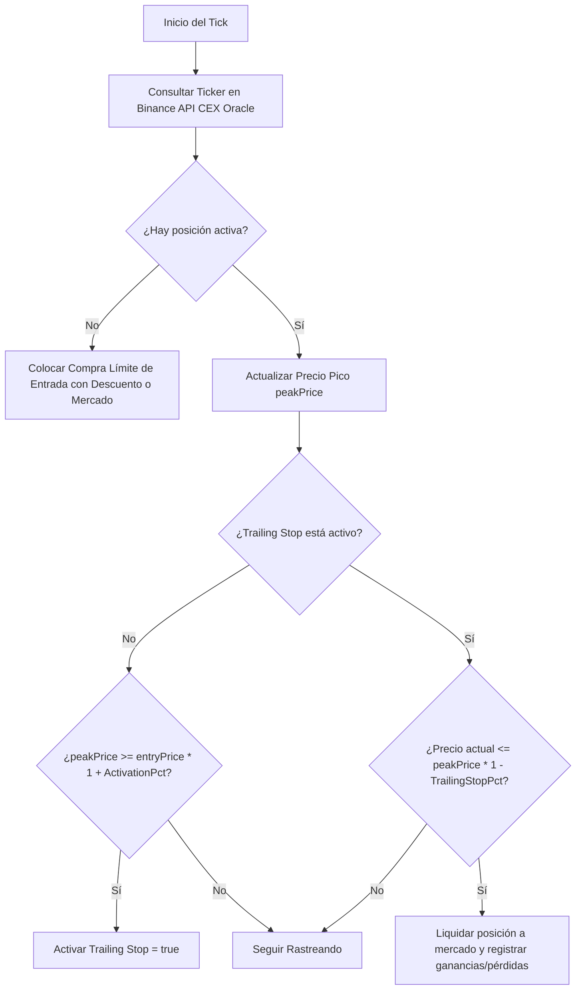

# 🏛️ Estrategia Agartha — Moonshot Trailing (Volatile Asset Trend)

**Agartha** es un algoritmo de **seguimiento de tendencias exponenciales (Trailing Stop)** diseñado específicamente para operar activos altamente volátiles de baja capitalización (tokens del sector Alpha, como `FARM`, `POND`, `BOB`, `TA`, etc.). 

El objetivo principal de Agartha es capturar el recorrido máximo de pumpeos verticales repentinos y liquidar la posición de manera automatizada ante la primera señal de retroceso, recortando pérdidas rápidamente si el pumpeo falla.

---

## ⚙️ Parámetros de Configuración (.env)

Para operar de forma segura, Agartha requiere definir parámetros de aislamiento y selección de tokens:

| Variable | Valor Recomendado | Descripción |
| :--- | :---: | :--- |
| `STRATEGY` | `agartha` | Activa la estrategia Agartha en Helena. |
| `AGARTHA_ASSET_CODE` | `FARM` | Símbolo del token volátil a operar en el DEX de XRPL (IOU). |
| `AGARTHA_ASSET_ISSUER` | `rMoZZ...` | Cuenta emisora oficial del token IOU en el XRP Ledger. |
| `AGARTHA_CEX_ORACLE` | `FARMUSDT` | Par del oráculo en Binance Spot para cotización ultra veloz. |
| `AGARTHA_BUDGET_USD` | `100.0` | **Presupuesto Aislado** de capital máximo en USD dedicado a esta posición. |
| `AGARTHA_ACTIVATION_PROFIT_PCT`| `10.0` (10%) | Porcentaje de ganancia necesario para activar el rastreo del Trailing Stop. |
| `AGARTHA_TRAILING_STOP_PCT` | `15.0` (15%) | Margen de caída máxima permitida desde el pico antes de liquidar. |
| `AGARTHA_ENTRY_LIMIT_OFFSET_PCT`| `2.0` (2%) | Descuento límite para la compra de entrada. Si es `0`, entra a mercado. |
| `AGARTHA_MAX_HOLDING_LEDGERS` | `1000` (~1 hora) | **Time Stop**: Límite de bloques para liquidar la posición si el precio se estanca. |

---

## 🔄 Flujo Operativo y Trailing Stop

1.  **Detección a Alta Velocidad**: El bot no utiliza el feed del ledger para el precio de referencia, sino que consulta directamente la API Spot de Binance (`AGARTHA_CEX_ORACLE`) en cada tick para reaccionar a las mechas en milisegundos.
2.  **Entrada Límite o Spot**: Coloca una oferta de compra por el equivalente de `AGARTHA_BUDGET_USD` en el token elegido.
3.  **Activación de Trailing**: Si el token sube un **10%** desde el precio de compra, se activa el seguimiento dinámico.
4.  **Toma de Ganancias / Salida**: Si el precio del token sube un 80% y luego retrocede un **15%** (`AGARTHA_TRAILING_STOP_PCT`), el bot vende inmediatamente toda la posición, bloqueando la ganancia.
5.  **Aislamiento Financiero**: Agartha calcula los volúmenes y costes usando únicamente su presupuesto asignado `AGARTHA_BUDGET_USD`, garantizando que sus pérdidas o retenciones de saldo no afecten la liquidez del motor de arbitraje de Helena.

---

## 🛡️ Persistencia y Auditoría de Transacciones (DB Local)

La base de datos local `db.json` registra los siguientes identificadores para el seguimiento de Agartha:

*   `AGARTHA_ENTRY_LIMIT`: Colocación de la orden de entrada con descuento.
*   `AGARTHA_LIMIT_FILLED`: Llenado de la orden límite y apertura de la posición.
*   `AGARTHA_BUY`: Compra de entrada ejecutada directamente a mercado.
*   `AGARTHA_LIQUIDATED`: Liquidación y cierre de la posición (ya sea por `TRAILING_EXIT` o `TIME_STOP`).

---

## 📈 Tesis de Backtest y Experiencias Históricas (Alpha Cluster)

De acuerdo con el desarrollo y la bitácora de construcción del **Agartha Cluster** (registrado en los archivos de backtesting e histogramas históricos en `generikDBHistogramData` y `cvzBackTestForBotsInHistograms` al 25/05/2026), se extrajeron las siguientes conclusiones de diseño y reglas de producción:

### 1. Filosofía de Posición Fija Sin Stop Loss
*   **Decisión de Diseño**: Cada bot o par opera con un **presupuesto o volumen de compra fijo (ej: 10 USDT)**. No se utiliza Stop Loss estricto por precio.
*   **Razón**: Dado que se opera con activos de baja capitalización altamente volátiles (tokens Alpha), las pérdidas por par están limitadas al 100% de la posición pequeña inicial (que suele irse a cero en el peor escenario), mientras que las ganancias por capturar un pumpeo radical son asimétricas (pueden ser de 10x o más). Un solo "mega-winner" compensa las pérdidas de múltiples intentos fallidos.
*   **Inactividad Indefinida**: Las posiciones se dejan correr indefinidamente con el trailing stop local activo a la espera del pumpeo.

### 2. Trailing Stop Local por Software
*   **Decisión de Diseño**: Dado que la red XRP Ledger y la API Spot de Binance no ofrecen órdenes de tipo Trailing Stop nativas (solo permiten órdenes límites estándar `OfferCreate` o `LIMIT`), **el Trailing Stop se calcula y monitorea localmente en el código del bot**.
*   **Resiliencia ante Crashes**: Para evitar que un crash o reinicio del bot borre el precio pico (`peakPrice`) y rompa la lógica del trailing, **el bot persiste inmediatamente el estado en `db.json` (`agartha_state`) en cada tick del ledger**.

### 3. Manejo de Fallos en Órdenes de Venta Límite (Re-quote Escalonado)
Cuando el Trailing Stop local se activa y dispara la señal de salida, el bot envía una orden de venta límite (`OfferCreate` / `SELL LIMIT`). Si la orden no se llena debido al deslizamiento rápido del precio (slippage) del token, se ejecuta el siguiente protocolo asíncrono y escalonado de re-cotización:

| Tiempo transcurrido | Acción Correctiva | Estado / Evento |
| :--- | :--- | :--- |
| **< 60 segundos** | Si se llena, cierra el ciclo normalmente. | `exit_filled` |
| **A los 60 segundos** | Cancela la orden actual y reenvía una `SELL LIMIT` al **bid actual** (más agresivo). | `exit_reorder` |
| **A los 5 minutos** | Cancela la orden actual y reenvía una `SELL LIMIT` al **borde inferior de la banda permitida** (`TRAIL_BORDER`). | `exit_border` |
| **A los 10 minutos** | Cancela la orden y marca la posición como estancada (`stale_exit`), enviando una **alerta al supervisor humano** para ejecución o cierre manual. | `stale_exit` |

*Nota: El supervisor humano puede forzar el cierre de una posición marcada como `stale_exit` o trabada a través del comando `cli supervisor close <bot_id>` de forma segura.*

