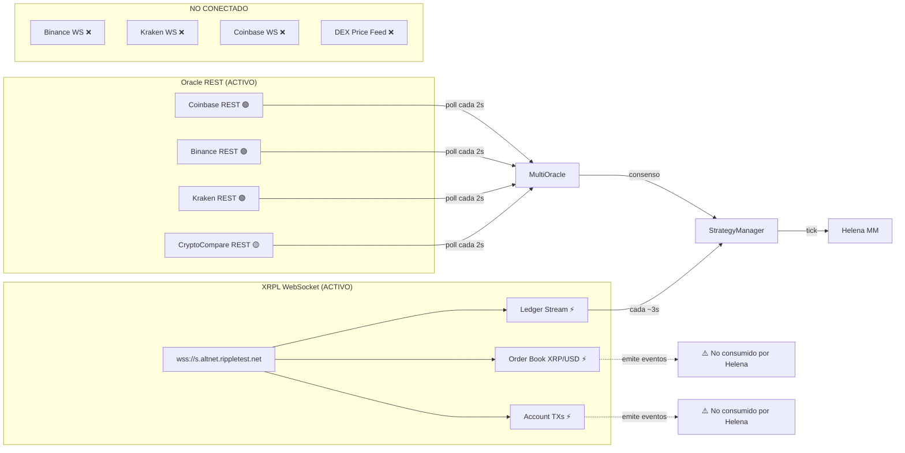

# Helena — Fuentes de Datos y Arquitectura de Conectividad

## Estado Actual

### 🔌 Conexiones Activas



### Detalle de cada fuente

| Fuente | Tipo | Latencia | Usado por | Estado |
|--------|------|:--------:|-----------|:------:|
| **XRPL Ledger Stream** | WebSocket push | ~0ms (real-time) | StrategyManager → tick trigger | ✅ Activo |
| **XRPL Order Book** | WebSocket subscribe | ~0ms | WebSocketReader → emite `orderBookUpdate` | ⚠️ **Suscrito pero no consumido** |
| **XRPL Account TXs** | WebSocket subscribe | ~0ms | WebSocketReader → emite `ownTransaction` | ⚠️ **Suscrito pero no consumido** |
| **XRPL `book_offers`** | RPC on-demand | 200-500ms | IOC mode → lee 10 niveles DEX | ✅ Activo |
| **XRPL `account_offers`** | RPC on-demand | 200-500ms | checkForFills → detecta fills | ✅ Activo |
| **Coinbase** | REST poll | 500-1500ms | MultiOracle → precio consenso | ✅ Peso: 1.0 |
| **Binance** | REST poll | 500-1500ms | MultiOracle → precio consenso | ✅ Peso: 1.0 |
| **Kraken** | REST poll | 500-2000ms | MultiOracle → precio consenso | ✅ Peso: 0.8 |
| **CryptoCompare** | REST poll | 500-2000ms | MultiOracle → precio consenso | 🟡 Peso: 0.6, requiere API key |

---

## Problemas Detectados

### 1. 🔴 WebSocket Events Desperdiciados
[websocketReader.ts](file:///c:/Users/lexar/Desktop/xrpL/src/websocketReader.ts) suscribe a `orderBookUpdate` y `ownTransaction` pero **Helena no los escucha**. Son eventos gratuitos (ya pagamos el socket) que podrían:
- `orderBookUpdate` → Actualizar precio DEX en tiempo real sin hacer `book_offers` RPC
- `ownTransaction` → Detectar fills **instantáneamente** en vez de polling `account_offers` cada tick

### 2. 🟡 Oracle = Solo REST Polling
[multiOracle.ts](file:///c:/Users/lexar/Desktop/xrpL/src/multiOracle.ts) hace HTTP GET cada 2s a 4 APIs. Binance, Kraken y Coinbase ofrecen WebSocket feeds con ~100ms de latencia vs 1-2s REST.

### 3. 🟡 DEX Price No Alimenta Oracle
El IOC mode ya lee `book_offers` (precio real del DEX), pero ese dato **no se retroalimenta** al MultiOracle. Los modos pasivos operan ciegamente con el precio de CEXs.

---

## ¿Está Helena preparada para más fuentes?

### ✅ Sí, la arquitectura lo soporta

| Componente | Extensibilidad |
|-----------|:--------------:|
| **MultiOracle** | `ORACLE_SOURCES[]` es un array — agregar fuente = agregar objeto | ✅ Fácil |
| **WebSocketReader** | Patrón EventEmitter — solo agregar listeners | ✅ Fácil |
| **StrategyManager** | Recibe `marketPrice` como número — agnóstico de la fuente | ✅ Desacoplado |
| **Config** | Todos los params vienen de `.env` | ✅ Flexible |

### ❌ Pero necesita trabajo de integración

| Integración | Qué haría | Esfuerzo | Impacto |
|------------|-----------|:--------:|:-------:|
| **Consumir `orderBookUpdate`** | Precio DEX real-time sin RPC extra | 0.5 día | 🔴 Alto |
| **Consumir `ownTransaction`** | Fills instantáneos, eliminar polling `account_offers` | 0.5 día | 🔴 Alto |
| **Binance WebSocket** | Precio CEX con ~100ms latencia vs 1-2s REST | 1 día | 🟡 Medio |
| **DEX price → Oracle** | Modos pasivos usan precio real del mercado | 0.5 día | 🟡 Medio |
| **Coingecko** | Fuente oracle adicional | 0.5 día | 🟢 Bajo |
| **XRPL Mainnet multi-nodo** | Redundancia de conexión | 1 día | 🟡 Medio |

---

## Resumen Ejecutivo

```
ACTUALMENTE:
  ├─ 1 WebSocket XRPL (3 suscripciones, solo 1 usada activamente)
  ├─ 4 APIs REST para precio (poll cada 2s)
  └─ 2 RPCs on-demand por tick (book_offers + account_offers)

LO QUE SE DESPERDICIA:
  ├─ orderBookUpdate → precio DEX real-time gratis
  └─ ownTransaction  → fills instantáneos gratis

LO QUE FALTA:
  ├─ WebSocket feeds de CEXs (Binance/Coinbase)
  ├─ DEX price como fuente del oracle
  └─ Multi-nodo XRPL para redundancia
```

> **Helena tiene la arquitectura correcta para escalar**, pero hoy usa solo ~40% de los datos que ya recibe. El quick-win más grande es consumir los WebSocket events que ya tiene suscrito.
