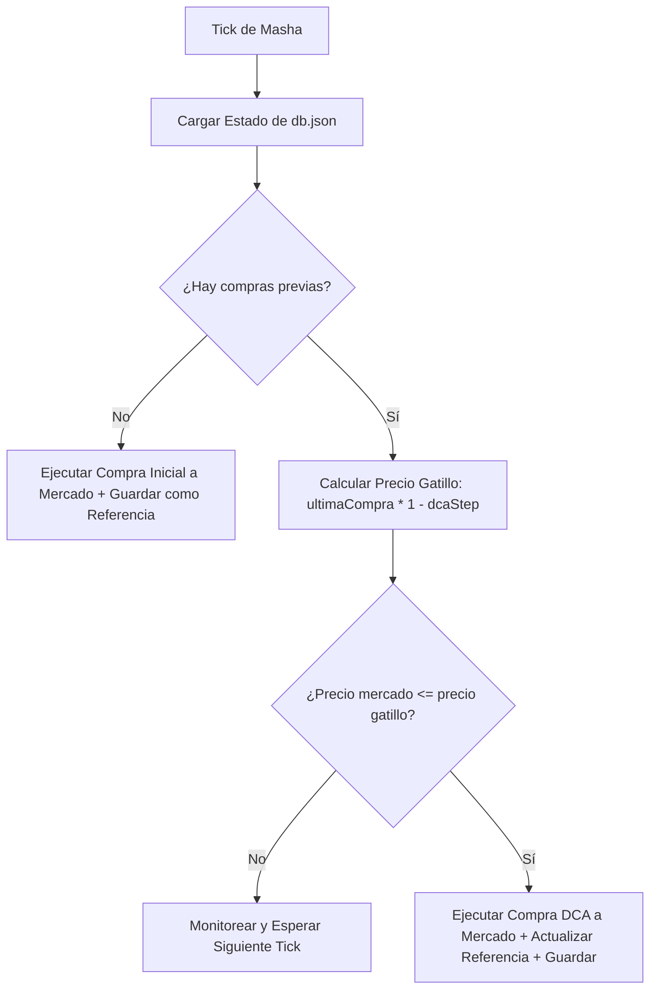

# 👧 Estrategia Masha — DCA Accumulator (Pure HODL)

**Masha** es un algoritmo de **acumulación recurrente (HODL)**. A diferencia de las estrategias comerciales tradicionales, Masha no coloca órdenes límites de venta ni busca cerrar posiciones en el corto plazo; su objetivo exclusivo es construir un portafolio a largo plazo (bolsa de ahorro) promediando las compras hacia abajo durante caídas del mercado.

---

## ⚙️ Parámetros de Configuración (.env)

| Variable | Valor Recomendado | Descripción |
| :--- | :---: | :--- |
| `STRATEGY` | `masha` | Activa el acumulador Masha en Helena. |
| `MASHA_DCA_STEP_PCT` | `2.0` (2%) | Caída porcentual requerida respecto a la última compra para ejecutar el siguiente peldaño. |
| `MASHA_BUY_QTY_XRP` | `10` | Cantidad de XRP a comprar a mercado en cada nivel de acumulación. |

---

## 🔄 Lógica del Ciclo de Acumulación

1.  **Compra Inicial**: Al arrancar por primera vez (o con historial vacío), Masha ejecuta una compra Spot a mercado inmediata de XRP para establecer el precio de referencia inicial.
2.  **Pasos de Descuento (DCA)**: En los ticks sucesivos, calcula el precio gatillo:
    $$\text{Precio Gatillo} = \text{Último Precio de Compra} \times \left(1 - \frac{\text{MASHA\_DCA\_STEP\_PCT}}{100}\right)$$
    Si el precio de mercado cruza hacia abajo este límite, el bot ejecuta otra compra de la misma cantidad base de XRP y actualiza el último precio de compra al nivel actual.
3.  **HODL bag**: Los XRP comprados se conservan en la wallet para hold de largo plazo (usualmente para ser depositados en servicios earn de bajo riesgo). No se colocan ofertas de venta en el DEX de XRPL.

---

## 🛡️ Persistencia y Resiliencia ante Crashes

Masha requiere un control estricto de su estado histórico para evitar compras duplicadas o inconsistencias tras desconexiones:

*   **Registro en DB Local**: Tras cada compra exitosa, Masha actualiza y persiste su estado en `db.json` bajo la variable `custom.masha_state`. Guarda el listado de compras con su `timestamp`, `price`, `qty` y `txHash` para auditoría.
*   **Recuperación en Arranque (Default)**: Al iniciar o reconectarse tras un error de red o apagado, Masha por defecto **carga el último registro de compra guardado en la base de datos**. Esto previene que el bot compre de inmediato al iniciar si ya se había realizado una compra al mismo nivel de precios en la sesión anterior.

---

## 📝 Registro de Auditoría de Transacciones (DB Local)

Masha registra de forma estructurada los siguientes eventos en la base de datos local:

*   `MASHA_BUY`: Registrado tras completar de forma exitosa cada compra Spot a mercado (tanto la inicial como las consecutivas por caídas DCA).
