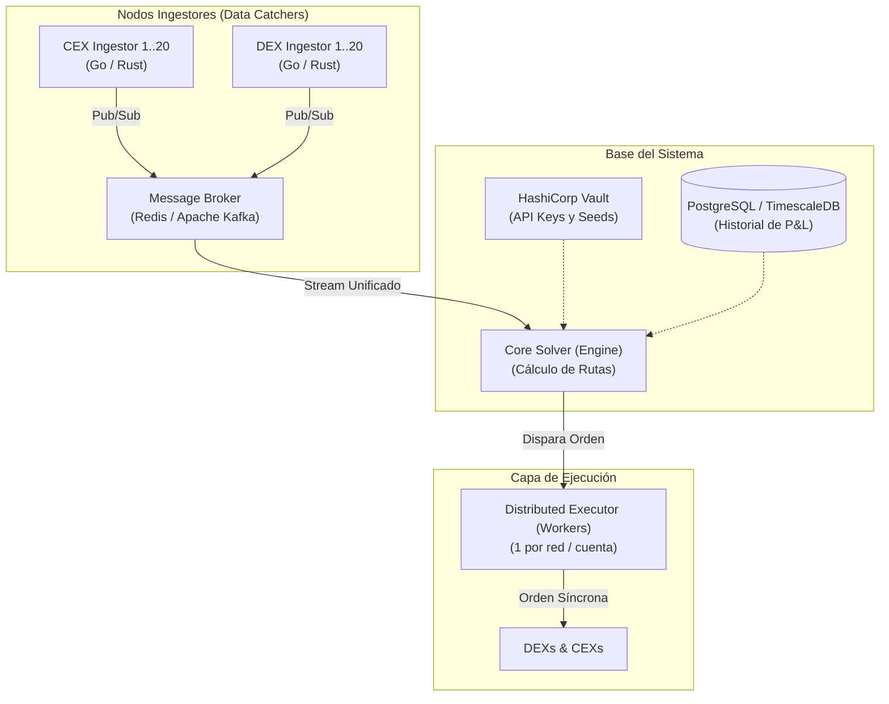

# 🚀 Escalabilidad de Helena: Integración de 40 Venues (20 DEXs + 20 CEXs)

Este documento analiza el comportamiento, complejidad y requisitos de infraestructura necesarios para escalar a **Helena** de un bot de 2 patas a un sistema de arbitraje global concurrente en 40 plataformas.

---

## 1. Comportamiento del Sistema con 40 Venues

Al conectar 20 DEXs y 20 CEXs simultáneamente, el espacio de oportunidades se expande de forma combinatoria:
*   **Caminos de Arbitraje 2-Patas**: $40 \times 39 = 1560$ pares de mercados posibles.
*   **Caminos de Arbitraje Multi-salto (Triangular)**: Millones de combinaciones posibles en tiempo real.

Sin embargo, a nivel computacional y de red, un solo proceso Node.js (como el actual de Helena) colapsaría por las siguientes razones:

```
[40 Conexiones WS/REST] ──> [1 Solo Hilo de Node.js] ──> Cuello de Botella (Event Loop bloqueado)
                                                      ──> Desincronización de Precios (Stale Prices)
                                                      ──> Pérdida de Fondos (Ejecuciones Tardías)
```

1.  **Bloqueo del Event Loop**: Parsear miles de mensajes de libros de órdenes por segundo en el único hilo de Node.js retrasaría el cálculo de los ticks, provocando latencias altas (>2 segundos). En HFT (High-Frequency Trading), una latencia superior a 100ms significa perder el arbitraje frente a otros bots.
2.  **Fragmentación de Inventario (Capital)**: Si tienes un capital de $20,000 USD y debes repartirlo en 40 exchanges para poder arbitrar al instante en cualquiera, tocarías a **$500 USD por exchange**. Esto reduce el tamaño de orden máximo y disminuye drásticamente la rentabilidad neta.
3.  **Límites de Tarifa de API (Rate Limiting)**: El bot sería bloqueado/baneado por las IPs de CEXs y nodos RPC debido a la inmensa cantidad de consultas repetitivas de balance y estados de orden.

---

## 2. Propuesta de Arquitectura Distribuida Perpetua

Para operar perpetuamente en 40 venues con alta confiabilidad y latencia ultra baja, Helena debe evolucionar de un script **monolítico** a una **arquitectura distribuida de microservicios**:



### Componentes de la Arquitectura Escalable:
1.  **Ingestores de Datos Desacoplados (Data Catchers)**:
    *   Módulos independientes (escritos en Go o Rust por eficiencia de memoria) cuyo único trabajo es mantener la conexión WebSocket con el exchange (CEX/DEX), parsear el libro de órdenes al instante y enviarlo formateado al Message Broker.
2.  **Message Broker Central (Redis / Kafka)**:
    *   Canal de comunicación de alta velocidad que recibe todos los libros de órdenes y distribuye un stream consolidado de precios en tiempo real.
3.  **Core Solver (El Cerebro)**:
    *   Un único proceso matemático (escrito en Rust o C++) que aplica algoritmos de optimización de grafos (como *Bellman-Ford* o *Floyd-Warshall*) sobre el stream de Redis para detectar spreads rentables de forma instantánea.
4.  **Ejecutores Concurrentes (Workers)**:
    *   Microservicios encargados de la firma de transacciones y envío a las redes correspondientes (un ejecutador para EVM, uno para Solana, uno para CEXs). Esto garantiza que un retraso en la red Ethereum no congele los arbitrajes en curso de Solana o Binance.

---

## 3. ¿Qué Necesitarías para Desplegar este Sistema?

Para montar este círculo de arbitraje de 40 venues y dejarlo operando de forma perpetua, se requiere lo siguiente:

### A. Infraestructura Tecnológica
*   **Servidores VPS dedicados de Alta Gama (AWS o Bare Metal)**: Ubicados estratégicamente cerca de los servidores de los exchanges (típicamente en **Tokio**, **Londres** o **Virginia del Norte**) para minimizar la latencia de red a menos de 5ms.
*   **Nodos RPC Privados Dedicados**: Para no depender de nodos públicos lentos. Necesitarías un nodo dedicado para Solana (ej. Jito), uno para Arbitrum, uno para Base y uno para XRPL.
*   **Orquestación con Kubernetes/Docker**: Para levantar y reiniciar automáticamente cualquiera de los 40 ingestores si llega a caerse la conexión de red (auto-healing).

### B. Gestión y Capital
*   **Capital de Operación Elevado**: Al menos **$50,000 USD** de capital para fonear inventarios mínimos en los principales exchanges y evitar que las cuentas se queden sin saldo líquido (Leg-Lock).
*   **Monitoreo y Alertas**: Un panel centralizado (Grafana + Prometheus) para monitorizar el estado de salud, uso de CPU/RAM, y alertas inmediatas vía Telegram si ocurre un desbalance de inventario.
