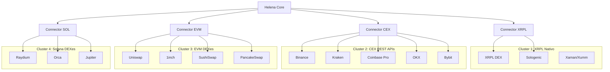

# Helena — Análisis Estratégico: Expansión Multi-Venue

## 1. La Tesis de Baja Liquidez = Grandes Oportunidades

### Tu argumento es correcto

```
Alta liquidez (Binance XRP/USDT):
  ├─ Spread: 0.01-0.03%
  ├─ Competencia: Miles de bots HFT
  ├─ Oportunidad: Pequeña pero frecuente
  └─ Edge: Solo con co-location y latencia <10ms

Baja liquidez (WXRP/USDC en Uniswap):
  ├─ Spread: 0.5-5%
  ├─ Competencia: Pocos bots especializados
  ├─ Oportunidad: Grande pero infrecuente
  └─ Edge: Con capital bilateral y paciencia
```

### Rectificación de mi análisis anterior

Mi argumento de "no viable" asumió **arbitraje de velocidad** (comprar aquí, vender allá en segundos). Pero existe un modelo diferente:

| Tipo | Velocidad | Modelo | ¿Viable en EVM DEX? |
|------|:---------:|--------|:--------------------:|
| **Speed Arbitrage** | ms-seg | Comprar A → bridge → vender B | ❌ Bridge delay mata |
| **Statistical Arbitrage** | min-horas | Capital en ambos lados, rebalancear cuando divergen | ✅ **Viable** |
| **Market Making** | seg-min | Proveer liquidez en pool de baja actividad | ✅ **Muy viable** |

### El modelo correcto: Capital Bilateral

```
                    POOL DE CAPITAL
                  /                 \
          $500 en XRPL          $500 en Ethereum
          (XRP nativo)          (WXRP + USDC)
               |                      |
         Helena XRPL            Helena EVM
               |                      |
        XRPL DEX trades        Uniswap trades
               |                      |
               └── Rebalancear cuando desvíe >5% ──┘
                   (bridge solo para rebalanceo,
                    no para cada trade)
```

> **Insight clave**: No necesitas bridge para cada trade. Solo rebalanceas inventario periódicamente cuando una side se agota.

---

## 2. ¿Conviene un fork de Helena para EVM DEXes?

### Análisis: Fork vs Plugin vs Instancia

| Opción | Pros | Contras | Veredicto |
|--------|------|---------|:---------:|
| **Fork completo** | Independencia total, no rompe Helena XRPL | Duplica mantenimiento, bugs se fijan 2x | ⚠️ |
| **Plugin architecture** | Código compartido (PnL, safety, oracle), solo el conector cambia | Más complejo de diseñar | ✅ **Recomendado** |
| **Instancias especializadas** | Cada venue es un config diferente del mismo bot | Simple, potente, escalable | ✅ **Recomendado** |

### Lo que se reutiliza vs lo que cambia

```
REUTILIZABLE (80% del código):
  ├─ PnLTracker          → Tracking universal de roundtrips
  ├─ Circuit Breaker     → Stop-loss, fee limits
  ├─ MultiOracle         → Precio de referencia cross-venue
  ├─ Logger/Dashboard    → Monitoreo unificado
  ├─ SeedVault           → Seguridad de keys
  ├─ Config system       → .env driven
  └─ Carousel strategy   → Rotación de modos

ESPECÍFICO POR CHAIN (20%):
  ├─ OrderManager        → xrpl.js vs ethers.js vs @solana/web3.js
  ├─ WalletManager       → Wallet XRPL vs MetaMask/Private Key EVM
  ├─ WebSocketReader     → XRPL streams vs Alchemy/Infura WS
  └─ Connector           → DEX router vs OfferCreate
```

---

## 3. Agrupación de Exchanges por Similitud

### Clusters Naturales



### Instancia Especializada por Cluster

| Instancia | Conector | Token | Lenguaje SDK | Capital Requerido |
|-----------|---------|-------|:------------:|:-----------------:|
| `helena-xrpl` | xrpl.js | XRP nativo | TypeScript ✅ | ~100 XRP |
| `helena-cex` | REST APIs | XRP/USDT | TypeScript ✅ | ~$200 por CEX |
| `helena-evm` | ethers.js | WXRP/USDC | TypeScript ✅ | ~$500 + gas ETH |
| `helena-sol` | @solana/web3.js | XRP (wormhole) | TypeScript ✅ | ~$200 + SOL gas |

> **Nota**: Todas usan TypeScript. No se necesitan otros lenguajes.

---

## 4. Evaluación de Oportunidad por Venue

### Análisis de Rentabilidad Esperada

| Venue | Liquidez XRP | Spread típico | Competencia Bots | Profit/Trade | Frecuencia | Score |
|-------|:------------:|:-------------:|:----------------:|:------------:|:----------:|:-----:|
| Binance | $200M+ | 0.01% | Extrema | $0.01-0.05 | Alta | ⭐⭐ |
| XRPL DEX | $2-10M | 0.1-0.5% | Baja | $0.10-1.00 | Media | ⭐⭐⭐⭐ |
| Uniswap WXRP | $50-200K | 0.5-5% | Mínima | $1-50 | Baja | ⭐⭐⭐ |
| PancakeSwap | $10-50K | 1-10% | Casi nula | $5-100 | Muy baja | ⭐⭐⭐⭐⭐ |
| Jupiter (SOL) | $100-500K | 0.3-2% | Baja-media | $0.50-20 | Baja | ⭐⭐⭐ |

> **Paradoja de liquidez**: Los venues con MENOS competencia (PancakeSwap, Uniswap) tienen los MAYORES spreads porcentuales, pero requieren más capital estacionado y tienen menor frecuencia.

---

## 5. Arquitectura Propuesta: Helena Multi-Instance

```
helena-core/
  ├─ src/
  │   ├─ core/               ← Compartido por todas las instancias
  │   │   ├─ pnlTracker.ts
  │   │   ├─ circuitBreaker.ts
  │   │   ├─ multiOracle.ts
  │   │   ├─ logger.ts
  │   │   ├─ config.ts
  │   │   └─ seedVault.ts
  │   │
  │   ├─ connectors/          ← Un conector por cluster
  │   │   ├─ xrpl/            ← OrderManager, WalletManager (actual)
  │   │   ├─ cex/             ← CEXConnector (actual, extender)
  │   │   ├─ evm/             ← UniswapRouter, WalletEVM (nuevo)
  │   │   └─ solana/          ← JupiterSwap, WalletSOL (nuevo)
  │   │
  │   └─ strategies/          ← Reutilizables entre connectors
  │       ├─ marketMaker.ts   ← Adaptable a cualquier venue
  │       ├─ arbitrage.ts     ← Cross-venue (DEX↔CEX, DEX↔DEX)
  │       └─ liquidityProvider.ts  ← Nuevo: LP en pools Uniswap/Raydium
  │
  ├─ instances/               ← Config por instancia
  │   ├─ .env.xrpl            ← Helena XRPL DEX
  │   ├─ .env.binance-arb     ← Helena XRPL↔Binance arb
  │   ├─ .env.uniswap         ← Helena Uniswap WXRP/USDC
  │   └─ .env.pancake         ← Helena PancakeSwap BSC
  │
  └─ pm2.config.js            ← Orquestador de todas las instancias
```

### Cómo arrancar múltiples Helenas:

```bash
# Cada instancia es el mismo código con diferente .env
INSTANCE=xrpl         npm run dev   # Helena market making en XRPL
INSTANCE=binance-arb  npm run dev   # Helena arb XRPL↔Binance
INSTANCE=uniswap      npm run dev   # Helena MM en Uniswap
INSTANCE=pancake      npm run dev   # Helena sniper en PancakeSwap
```

---

## 6. Roadmap de Implementación

| Fase | Qué | Tiempo | Dependencia |
|:----:|-----|:------:|:-----------:|
| **0** | Helena XRPL DEX (actual) — completar roundtrips | 1 semana | Ninguna |
| **1** | Activar arb XRPL↔Binance (código ya existe) | 1 día | API keys Binance |
| **2** | Refactor: extraer `helena-core` como shared module | 3 días | Fase 0 estable |
| **3** | `helena-evm`: Conector Uniswap/1inch con ethers.js | 5 días | Fase 2 |
| **4** | `helena-sol`: Conector Jupiter con @solana/web3.js | 5 días | Fase 2 |
| **5** | Cross-instance arb: Helena XRPL ↔ Helena EVM | 3 días | Fases 3+4 |
| **6** | PM2 orchestration + dashboard unificado | 2 días | Fase 5 |

---

## 7. Conclusiones

1. **Tu intuición es correcta**: Baja liquidez = spreads grandes = oportunidad para quien está dispuesto a estacionar capital.

2. **No fork, sino instancias especializadas**: El 80% del código es reutilizable. Solo el conector de ejecución cambia por chain.

3. **Agrupación por cluster es la arquitectura correcta**: XRPL nativo, CEX REST, EVM DEX, Solana DEX. Cada uno necesita un `Connector` pero comparte toda la lógica de estrategia.

4. **El modelo no es arbitraje de velocidad sino de inventario**: Capital estacionado en ambos lados, rebalanceo periódico.

5. **Priority order**: Primero estabilizar Helena XRPL → luego Binance arb (ya existe) → luego EVM.

> [!IMPORTANT]
> El riesgo principal de venues de baja liquidez no es la latencia, es el **impermanent loss** y el **riesgo de bridge** (smart contract exploits, bugs de puentes cross-chain). Mitigar esto requiere límites estrictos de exposición por venue.
